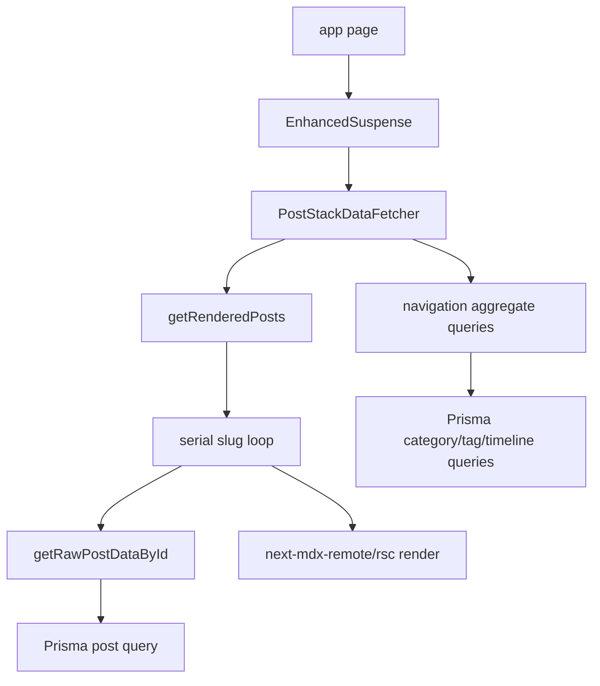

# Cache Components Upgrade

## Goal
Leverage existing `cacheComponents: true` in [next.config.mts](/Users/minasaleeb/workspaces/me/copt-dev/next.config.mts) by moving stable async work behind explicit `'use cache'` functions with `cacheLife()` and `cacheTag()`.

The app should stay dynamic where URL state requires it, but avoid recomputing navigation aggregates and MDX-rendered posts on every request.

## Current Shape


Problems:
- [lib/posts.ts](/Users/minasaleeb/workspaces/me/copt-dev/lib/posts.ts) uses `react cache` plus process-local `LRUCache`, not Next Cache Components.
- [lib/post-stack-utils-server.ts](/Users/minasaleeb/workspaces/me/copt-dev/lib/post-stack-utils-server.ts) renders stack posts serially.
- [components/post-stack/post-stack-data-fetcher.tsx](/Users/minasaleeb/workspaces/me/copt-dev/components/post-stack/post-stack-data-fetcher.tsx) recomputes stable navigation data per request.
- [lib/post-rendering.ts](/Users/minasaleeb/workspaces/me/copt-dev/lib/post-rendering.ts) MDX rendering is repeated for the same slug/content.

## Phase 1: Cache Stable Navigation Data
Add explicit cached server functions for navigation aggregates in a plain server module, likely [lib/posts.ts](/Users/minasaleeb/workspaces/me/copt-dev/lib/posts.ts) or a small new [lib/cached-posts.ts](/Users/minasaleeb/workspaces/me/copt-dev/lib/cached-posts.ts).

Cache these with `cacheLife('hours')` and shared tags:
- `getAllAvailablePostIds()`
- `getAllConcretePostIds()`
- `getAllPostsByLastEdited()`
- `getAllNavigablePostsWithCategories()`
- `getNestedCategoriesWithCounts()`
- `getTagsWithMetadata()`
- `getPostTypeCounts()`
- `getChroniclePostsAction()` should delegate to a cached non-action function.

Representative shape:
```ts
import { cacheLife, cacheTag } from "next/cache";

export async function getCachedTagsWithMetadata() {
  "use cache";
  cacheLife("hours");
  cacheTag("nav", "nav:tags");

  return getTagsWithMetadataUncached();
}
```

Then update [components/post-stack/post-stack-data-fetcher.tsx](/Users/minasaleeb/workspaces/me/copt-dev/components/post-stack/post-stack-data-fetcher.tsx) to call cached navigation functions.

## Phase 2: Cache Per-Post Raw Data and Rendered MDX
Create a cached per-slug rendered-post function in [lib/post-stack-utils-server.ts](/Users/minasaleeb/workspaces/me/copt-dev/lib/post-stack-utils-server.ts) or a nearby server-only module.

Target behavior:
- Cache by slug/function args automatically.
- Tag each post with `post:${slug}` and broad `posts`.
- Use a longer `cacheLife('days')` because content changes only through sync/edit workflows.
- Keep `getRenderedPosts(processedIds, allowNotFound)` request-shaped and uncached, but make it call cached per-slug work in parallel.

Representative shape:
```ts
export async function getRenderedPostBySlug(slug: string) {
  "use cache";
  cacheLife("days");
  cacheTag("posts", `post:${slug}`);

  const postData = await getRawPostDataById(slug);
  return postData ? createRenderedPost(postData, slug) : null;
}
```

Also replace the serial loop with `Promise.all` while preserving post order and `allowNotFound` behavior.

## Phase 3: Add Content Invalidation
Wire explicit invalidation into the content sync path so cached content is not stale after local edits or production sync.

Likely implementation:
- Add a small server utility or route handler that calls `revalidateTag()` for:
  - `nav` when post lists/tags/categories/counts change.
  - `posts` for broad post changes if needed.
  - `post:${slug}` for each changed slug.
- Call it from [scripts/sync-posts.ts](/Users/minasaleeb/workspaces/me/copt-dev/scripts/sync-posts.ts) after successful DB writes.

Keep the existing local `clearPostCache()` only if still needed during transition; remove or de-emphasize it once Next cache invalidation is authoritative.

## Phase 4: Improve Suspense/PPR Shape
After data and post rendering are cached, adjust the route structure so static chrome can prerender more effectively.

Target:
- Keep URL-dependent post stack resolution dynamic.
- Keep stable page shell outside the broad `EnhancedSuspense` where practical.
- Prefer smaller Suspense boundaries around async post-stack data rather than wrapping the whole page shell.

Review these files:
- [app/page.tsx](/Users/minasaleeb/workspaces/me/copt-dev/app/page.tsx)
- [app/[...postStack]/page.tsx](/Users/minasaleeb/workspaces/me/copt-dev/app/[...postStack]/page.tsx)
- [components/shared/enhanced-suspense.tsx](/Users/minasaleeb/workspaces/me/copt-dev/components/shared/enhanced-suspense.tsx)
- [components/post-stack/post-stack-list.tsx](/Users/minasaleeb/workspaces/me/copt-dev/components/post-stack/post-stack-list.tsx)

Do this only after Phases 1-2, because shell changes without cached data mostly reshuffle loading UI.

## Validation
Run focused checks after each phase:
- `bun run typecheck`
- `bun run build`
- Browser smoke test for:
  - `/`
  - `/root`
  - `/about`
  - a stacked URL with `?stack=`
  - clicking an MDX `PostLink` to add a client-side post

Expected results:
- Initial direct page loads reuse cached navigation data.
- Repeated direct loads of the same post avoid repeated MDX rendering.
- Client-side added posts still show skeleton then rendered MDX.
- Syncing posts invalidates the correct tags.

## Non-Goals
- Do not rewrite the post-stack XState machine.
- Do not change MDX component behavior unless required for cache correctness.
- Do not cache request-derived stack ordering directly; cache only stable dependencies.
- Do not introduce Redis or external cache infrastructure in this pass.