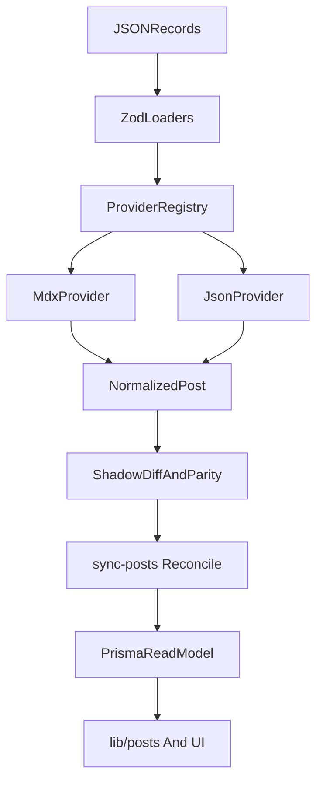

# JSON Control Plane Parity

## Goal

Move editable record-like data into validated JSON without weakening type safety or system expressiveness. Keep Prisma/Postgres as the serving/read model, but introduce a typed JSON control plane for provider management, post management, and future automation seams, with parity-proof validation before any cutover.

## Why The Prior Plan Needed Tightening

- `[types/post.ts](/Users/minasaleeb/workspaces/me/copt-dev/types/post.ts)` still hardcodes post-type unions and already drifts from Prisma by omitting `SIGHT`.
- `[scripts/lib/services/interactive-service.ts](/Users/minasaleeb/workspaces/me/copt-dev/scripts/lib/services/interactive-service.ts)` still duplicates template/type facts and even has stale choice text.
- `[lib/mdx-parser.ts](/Users/minasaleeb/workspaces/me/copt-dev/lib/mdx-parser.ts)` is not just a parser; it also owns derived findings/sights, category inference, date fallback behavior, Hlexicon extraction, and asset-side behavior. Any JSON move must prove parity with all of that.
- `[scripts/sync-posts.ts](/Users/minasaleeb/workspaces/me/copt-dev/scripts/sync-posts.ts)` currently reconciles by slug only, which is unsafe for a multi-provider control plane.

```18:19:types/post.ts
type?: "CONCRETE" | "BLOG" | "FINDING";
```

```55:64:scripts/lib/services/interactive-service.ts
while (true) {
  process.stdout.write("\nChoice (1-3): ");
  const choice = await this.readLine();
  const choiceNum = Number.parseInt(choice.trim(), 10);
  ...
  console.log("❌ Invalid choice. Please select 1, 2, or 3.");
}
```

```54:55:scripts/sync-posts.ts
const processedSlugs = new Set<string>();
```

## Revised Scope

### In Scope Now

- Typed JSON registries for editable metadata.
- Provider registry and JSON-managed post records.
- One canonical normalized post contract for all ingest sources.
- Provider provenance and provider-scoped reconcile/delete rules.
- Shared metadata consumers across scripts, validation, and UI.
- Proof harness and parity validation before cutover.

### Explicitly Deferred

- Full deployment job orchestration/control plane.
- Full admin UI.
- Site settings JSON unless it naturally falls out after the content control plane is stable.
- Likely `SIGHT` JSON cutover unless an asset manifest/materialization design is included; safest first cut is `CONCRETE`, `BLOG`, and `FINDING`.

## Sequence

1. Define the canonical normalized content contract first. Add a shared schema module such as `[lib/content-sources/schema.ts](/Users/minasaleeb/workspaces/me/copt-dev/lib/content-sources/schema.ts)` that describes `NormalizedPost`, `NormalizedCategoryPath`, provider metadata, lifecycle status, and source provenance. This becomes the only ingest shape accepted by the reconcile pipeline. Also normalize publish semantics now: public reads in `[lib/posts.ts](/Users/minasaleeb/workspaces/me/copt-dev/lib/posts.ts)` already key off `status`, while sync still writes both `status` and `published`; choose one truth path and make the other transitional/derived.
2. Extend the Prisma model for provenance before adding JSON posts. Update `[prisma/schema.prisma](/Users/minasaleeb/workspaces/me/copt-dev/prisma/schema.prisma)` so posts can safely track origin and sync state: provider/source type, provider record id or external id, source hash, last synced time, sync status, and possibly a tombstone/delete marker. Add unique constraints that prevent slug-only collisions from becoming cross-provider corruption.
3. Extract the current MDX behavior into a zero-behavior-change provider adapter. Split `[lib/mdx-parser.ts](/Users/minasaleeb/workspaces/me/copt-dev/lib/mdx-parser.ts)` into an `mdx-provider` that still preserves all current semantics:
  - derived `findings-*` and `sights-*` summary records
  - category inference from filesystem path
  - date fallback order
  - Hlexicon extraction/transformation
  - `original_url` handling
  - `SIGHT`-specific asset assumptions
   Add explicit `categoryPath` to the normalized contract so hierarchy no longer depends implicitly on `filePath` after multi-source ingest.
4. Move low-risk registries to JSON next, but route every consumer through typed loaders. Introduce `records/post-types.json` and `records/templates.json`, validate them with Zod, and make these consumers derive from the same loader output instead of duplicating facts:
  - `[scripts/lib/post-type-meta.ts](/Users/minasaleeb/workspaces/me/copt-dev/scripts/lib/post-type-meta.ts)`
  - `[lib/validation/navigation-schemas.ts](/Users/minasaleeb/workspaces/me/copt-dev/lib/validation/navigation-schemas.ts)`
  - `[types/post.ts](/Users/minasaleeb/workspaces/me/copt-dev/types/post.ts)`
  - `[scripts/lib/services/interactive-service.ts](/Users/minasaleeb/workspaces/me/copt-dev/scripts/lib/services/interactive-service.ts)`
  - `[scripts/lib/scaffold-templates.ts](/Users/minasaleeb/workspaces/me/copt-dev/scripts/lib/scaffold-templates.ts)` metadata layer
  - `[components/navigation/post-type-filter.tsx](/Users/minasaleeb/workspaces/me/copt-dev/components/navigation/post-type-filter.tsx)`
  - `[components/navigation/post-type-filter-compact.tsx](/Users/minasaleeb/workspaces/me/copt-dev/components/navigation/post-type-filter-compact.tsx)`
  - `[components/navigation/post-type-filter-bar.tsx](/Users/minasaleeb/workspaces/me/copt-dev/components/navigation/post-type-filter-bar.tsx)`
   Keep implementation-only style tokens, icons, and CSS module class bindings in code via a keyed adapter layer, not raw JSON.
5. Build the proof harness before introducing JSON posts. Add a shadow/report mode to `[scripts/sync-posts.ts](/Users/minasaleeb/workspaces/me/copt-dev/scripts/sync-posts.ts)` that emits normalized records and planned DB mutations. Then add parity tests that compare old behavior vs new adapter behavior using real fixtures and ephemeral DBs:
  - normalized output parity for MDX fixtures
  - DB diff parity for `Post`, `Tag`, `Category`, `CategoryEmbedding`, and `HlexiconEntry`
  - query parity for `[lib/posts.ts](/Users/minasaleeb/workspaces/me/copt-dev/lib/posts.ts)` and navigation actions
  - adversarial cases for invalid JSON, duplicate slugs, deleted records, and status transitions
   This validation step gates cutover; it should not be left to the end.
6. Add the JSON provider only after parity passes. Introduce `records/providers.json` plus `records/posts/*.json`, then add a `json-provider` that produces the same `NormalizedPost` contract as the MDX provider. Start with first-party managed posts and provider descriptors for future third-party integrations, but keep app reads DB-first. The reconcile layer in `[scripts/sync-posts.ts](/Users/minasaleeb/workspaces/me/copt-dev/scripts/sync-posts.ts)` must become provider-aware for create/update/delete/tombstone logic.
7. Prepare automation seams, but do not implement the full automation plane yet. Define typed provider settings that can later support deployment and publish automations: target id, trigger mode, env-secret key references, sync direction, and allowed actions. These should live in the provider registry schema so future server actions, route handlers, or workers can hook into the same control plane without another redesign.
8. Roll out by source or post type, not repo-wide in one cut. Recommended migration order:
  - first: post-type/template registries
  - second: zero-change MDX provider extraction
  - third: parity harness and reconcile safety
  - fourth: JSON provider for `BLOG` / `FINDING` / `CONCRETE`
  - last: `SIGHT`, site settings, and deployment jobs if still desired

## Validation Proof Concept

- Add a `records:validate` command that loads every JSON record, validates schemas, and checks referential integrity.
- Add cross-source parity fixtures: the same conceptual post represented as MDX and JSON must normalize identically except for provenance fields.
- Add provider collision tests so two providers with the same slug cannot clobber each other.
- Add reconcile tests for create, update, delete, and tombstone behavior per provider.
- Add black-box integration tests at real boundaries, consistent with `[CLAUDE.md](/Users/minasaleeb/workspaces/me/copt-dev/CLAUDE.md)`: CLI sync, DB mutation results, and public query parity.
- Add exhaustive assertions that registry keys equal the Prisma `PostType` enum and that no manual string union remains in app/types/validation layers.

## Coverage Map




## Most Important Files To Change

- `[prisma/schema.prisma](/Users/minasaleeb/workspaces/me/copt-dev/prisma/schema.prisma)`
- `[lib/mdx-parser.ts](/Users/minasaleeb/workspaces/me/copt-dev/lib/mdx-parser.ts)`
- `[scripts/sync-posts.ts](/Users/minasaleeb/workspaces/me/copt-dev/scripts/sync-posts.ts)`
- `[lib/posts.ts](/Users/minasaleeb/workspaces/me/copt-dev/lib/posts.ts)`
- `[types/post.ts](/Users/minasaleeb/workspaces/me/copt-dev/types/post.ts)`
- `[lib/validation/navigation-schemas.ts](/Users/minasaleeb/workspaces/me/copt-dev/lib/validation/navigation-schemas.ts)`
- `[scripts/lib/post-type-meta.ts](/Users/minasaleeb/workspaces/me/copt-dev/scripts/lib/post-type-meta.ts)`
- `[scripts/lib/scaffold-templates.ts](/Users/minasaleeb/workspaces/me/copt-dev/scripts/lib/scaffold-templates.ts)`
- `[scripts/lib/services/interactive-service.ts](/Users/minasaleeb/workspaces/me/copt-dev/scripts/lib/services/interactive-service.ts)`
- `[components/navigation/post-type-filter.tsx](/Users/minasaleeb/workspaces/me/copt-dev/components/navigation/post-type-filter.tsx)`
- `[components/navigation/post-type-filter-compact.tsx](/Users/minasaleeb/workspaces/me/copt-dev/components/navigation/post-type-filter-compact.tsx)`
- `[components/navigation/post-type-filter-bar.tsx](/Users/minasaleeb/workspaces/me/copt-dev/components/navigation/post-type-filter-bar.tsx)`

