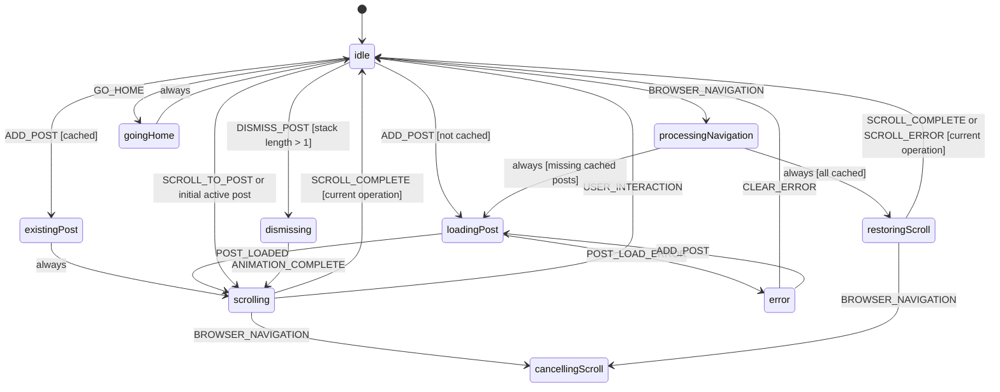
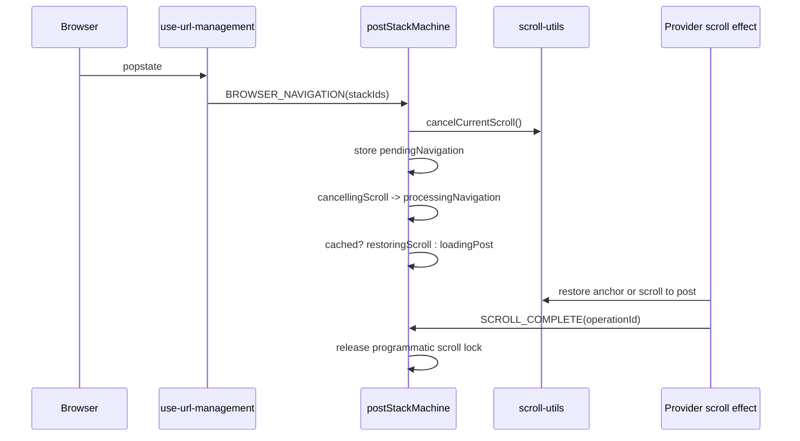
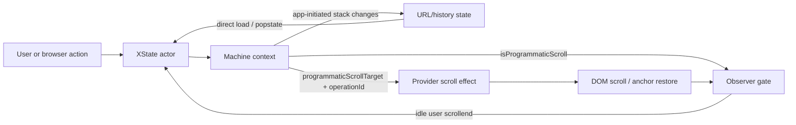

# feat: Visualize post stack statecharts

## Summary

Add a live-code-grounded post-stack architecture guide that uses XState-derived state diagrams, sequence diagrams, and a focused race matrix to explain how stack navigation, URL state, scroll restoration, and observer updates currently work.

---

## Problem Frame

The post-stack system is state-machine-driven but hard to reason about because behavior spans `lib/post-stack-machine.ts`, provider effects, URL hooks, scroll utilities, DOM observers, and browser history. Existing post-stack reference docs also drifted from the live machine by describing removed `settled` / `settling` states, so readers can learn the wrong flow.

---

## Assumptions

*This plan was authored without synchronous user confirmation. The items below are agent inferences that fill gaps in the input -- un-validated bets that should be reviewed before implementation proceeds.*

- The desired output is repository documentation plus source-grounding checks, not a new public UI route.
- The diagrams should explain current architecture before changing behavior; discovered behavior bugs should be documented with repro notes and deferred unless separately approved.
- XState is the source of truth for state transitions, while provider/hooks docs explain side effects that live outside the machine.

---

## Requirements

- R1. Derive the primary statechart from the live XState v5 machine in `lib/post-stack-machine.ts`.
- R2. Explain how URL/history state, machine context, scroll effects, and observer updates hand off ownership across the flow.
- R3. Replace stale post-stack documentation that mentions states or race guards no longer present in live code.
- R4. Include state or sequence diagrams for direct load, clicking a `PostLink`, dismissing a post, browser back/forward, and observer scroll-memory capture.
- R5. Include a complete event inventory so diagrams do not hide context-only or recovery events.
- R6. Add a lightweight validation checklist so diagrams stay grounded in live state/event names.
- R7. Keep visualization docs durable by avoiding line-number-heavy references and separating source-of-truth transitions from explanatory simplifications.

---

## Scope Boundaries

- No public navigation UI or production debug panel.
- No behavior fixes in this plan; suspected bugs get documented as follow-up work with reproduction notes.
- No Stately Inspector or external visualizer integration by default because post context contains rendered content and may be noisy or non-serializable.
- No broad rewrite of post-stack architecture docs outside the files directly used to explain state, browser navigation, and scroll flow.

### Deferred to Follow-Up Work

- Dev-only XState Inspector integration: separate PR after deciding how to sanitize actor snapshots.
- Regression tests or behavior fixes for race cases surfaced by the diagrams: separate PR after the current-flow diagrams are reviewed.
- Generated diagram tooling from machine AST: separate PR if hand-maintained Mermaid diagrams drift too often.

---

## Context & Research

### Relevant Code and Patterns

- `lib/post-stack-machine.ts` owns live states, events, context fields, guards, and transition actions.
- `components/post-stack/post-stack-provider-xstate.tsx` creates the actor, exposes `globalThis.__postStackActor`, and bridges `programmaticScrollTarget` into DOM scrolling.
- `hooks/use-url-management.ts` owns `history.state.stackIds`, manual scroll restoration, deferred URL pushes during programmatic scroll, and `BROWSER_NAVIGATION` dispatch.
- `hooks/use-scroll-management.ts` resolves target post elements, calls scroll utilities, and sends `SCROLL_COMPLETE` so standard scroll paths do not leave the machine stuck.
- `components/post-stack/post-stack-observer.tsx` only captures scroll memory and active post when hydrated, idle, and not programmatic.
- `tests/post-stack-scroll.spec.ts` already validates heading anchors, anchor capture, browser back/forward restore, and actor-idle waits.

### Institutional Learnings

- `.agents/skills/post-stack/SKILL.md` is the glossary and ownership map, but its flow summary is stale and must be verified against live source.
- `.agents/skills/post-stack/references/browser-integration.md` is useful for race framing, but it still describes a removed popstate debounce and an obsolete cancellation completion model.

### External References

- XState v5 inspection docs: actor snapshots and inspection events are useful for debugging transient states, but external inspection should be dev-only and sanitized.
- Stately import/export and Mermaid export are reference tools, not a round-trip source for this typed machine because guards/actions and large context are repo-specific.
- Next.js 16.2.6 Playwright docs confirm Playwright as the right end-to-end testing layer if follow-up behavior fixes need browser coverage.

---

## Key Technical Decisions

- Hand-author Mermaid `stateDiagram-v2` and sequence diagrams from live code first: this is lower-risk than adding generator tooling before the target diagrams are agreed.
- Put user-facing architecture docs under `docs/post-stack-statecharts.md`: repo docs are easier for humans to find than agent-skill-only references.
- Update `.agents/skills/post-stack/SKILL.md` and its browser-integration reference in the same change: stale agent docs would otherwise keep misleading future work.
- Treat `globalThis.__postStackActor.getSnapshot()` as a dev/test diagnostic aid, not a stable public API: it already exists and tests rely on it, so documentation can explain the useful fields while warning about churn.
- Describe URL ownership by phase: URL/history state seeds direct loads and browser navigation; machine context drives app-initiated URL writes after actor transitions.

---

## Open Questions

### Resolved During Planning

- Should the plan depend on XState tooling or code-derived diagrams? Resolution: use live machine semantics plus hand-authored Mermaid first; defer generator/Inspector integration.
- Should stale docs be fixed now or merely flagged? Resolution: fix stale post-stack references as part of the visualization work, because incorrect docs undermine the requested understanding.
- Should behavior tests and fixes be part of this visualization plan? Resolution: no; capture suspected issues as follow-up candidates unless the user approves a bug-fix pass.

### Deferred to Implementation

- Exact diagram granularity: decide while drafting whether one dense statechart or several concern-specific diagrams reads better.
- Whether browser-navigation missing-post flow can duplicate `currentStackIds`: capture as a suspected follow-up bug if confirmed during documentation audit.
- Whether user interruption needs explicit scroll abort behavior: capture as a suspected follow-up bug if the current behavior is unclear.

---

## Output Structure

    docs/
      post-stack-statecharts.md
    .agents/
      skills/
        post-stack/
          SKILL.md
          references/
            browser-integration.md

---

## High-Level Technical Design

> *This illustrates the intended approach and is directional guidance for review, not implementation specification. The implementing agent should treat it as context, not code to reproduce.*

### Live XState overview

### Browser navigation during active scroll

### Side-effect bridge

---

## Implementation Units

- U1. **Audit and repair stale post-stack references**

**Goal:** Align existing post-stack docs with live machine states, events, and race guards.

**Requirements:** R3, R7

**Dependencies:** None

**Files:**
- Modify: `.agents/skills/post-stack/SKILL.md`
- Modify: `.agents/skills/post-stack/references/browser-integration.md`
- Reference: `lib/post-stack-machine.ts`
- Reference: `hooks/use-url-management.ts`
- Reference: `lib/scroll-utils.ts`

**Approach:**
- Replace stale `settled`, `settling`, `settlingScroll`, debounce, cooldown, and `SCROLL_CANCELLED` descriptions with current `idle`, `processingNavigation`, `restoringScroll`, `cancellingScroll`, `existingPost`, `loadingPost`, `scrolling`, `dismissing`, `goingHome`, and `error` flow.
- Keep the skill concise; route detailed diagrams to `docs/post-stack-statecharts.md`.
- Prefer file/path references over brittle line references.

**Patterns to follow:**
- Current post-stack skill file map and invariant structure.
- Browser integration reference's table format, updated to current names and behavior.

**Test scenarios:**
- Test expectation: none -- documentation alignment only; validation is by cross-checking referenced states/events against `lib/post-stack-machine.ts`.

**Verification:**
- Existing post-stack references no longer describe states or guards absent from live source.

---

- U2. **Add live XState statechart documentation**

**Goal:** Create the primary statechart guide for current post-stack machine behavior.

**Requirements:** R1, R4, R5, R7

**Dependencies:** U1

**Files:**
- Create: `docs/post-stack-statecharts.md`
- Reference: `lib/post-stack-machine.ts`
- Reference: `components/post-stack/post-stack-provider-xstate.tsx`

**Approach:**
- Add Mermaid `stateDiagram-v2` diagrams split by concern when needed: main lifecycle, browser navigation, dismiss/home/error.
- Pair diagrams with a complete event inventory covering transition events, context-only events, recovery events, and observer/side-effect events: `ADD_POST`, `POST_LOADED`, `POST_LOAD_ERROR`, `DISMISS_POST`, `SCROLL_TO_POST`, `SET_ACTIVE_POST`, `ANIMATION_COMPLETE`, `SCROLL_COMPLETE`, `SCROLL_ERROR`, `URL_UPDATED`, `BROWSER_NAVIGATION`, `GO_HOME`, `CLEAR_ERROR`, `UPDATE_POST_CONTENT`, `USER_INTERACTION`, and `ENABLE_OBSERVER`.
- Explain transient `always` states so readers understand why snapshots may skip them.
- Document `globalThis.__postStackActor.getSnapshot()` as a dev/test diagnostic for current state and scroll lock, not as a supported production API.

**Patterns to follow:**
- Machine docblock in `lib/post-stack-machine.ts`.
- Existing Playwright actor snapshot wait in `tests/post-stack-scroll.spec.ts`.

**Test scenarios:**
- Test expectation: none -- documentation artifact; correctness comes from U1 source audit and U4 source-grounding checklist.

**Verification:**
- A reader can identify every live machine state and every live event's role without reading source.

---

- U3. **Document side-effect and sequence flows**

**Goal:** Explain how XState context drives browser and DOM effects outside the machine.

**Requirements:** R2, R4, R7

**Dependencies:** U2

**Files:**
- Modify: `docs/post-stack-statecharts.md`
- Reference: `components/post-stack/post-stack-provider-xstate.tsx`
- Reference: `hooks/use-url-management.ts`
- Reference: `hooks/use-scroll-management.ts`
- Reference: `components/post-stack/post-stack-observer.tsx`
- Reference: `lib/post-stack-utils-client.ts`

**Approach:**
- Add sequence diagrams for direct load, click-add, dismiss, browser back/forward during active scroll, and observer scroll-memory capture.
- Add a side-effect bridge diagram mapping context fields to URL/history updates, scroll execution, observer gating, and anchor persistence.
- Add a focused race matrix for only the guards needed to read the diagrams: `isProgrammaticScroll`, `scrollOperationId`, `pendingNavigation`, deferred URL pushes, `waitForPostStable`, and history scroll memory.
- Include a "known follow-up questions" note for suspected behavior gaps such as hard-coded browser navigation direction, missing-post duplicate stack IDs, and user-interruption scroll cancellation.

**Patterns to follow:**
- Provider comments that describe URL -> machine -> DOM synchronization.
- Existing scroll test comments that define deterministic behavior.

**Test scenarios:**
- Test expectation: none -- documentation artifact; behavior verification belongs to a later bug-fix or regression-test plan.

**Verification:**
- A reader can trace a user click, browser navigation, or scrollend from external event through machine state and back to DOM/URL effects.

---

- U4. **Add diagram source-grounding checks**

**Goal:** Make it clear how implementers and future agents keep diagrams from drifting.

**Requirements:** R6, R7

**Dependencies:** U2, U3

**Files:**
- Modify: `docs/post-stack-statecharts.md`
- Modify: `.agents/skills/post-stack/SKILL.md`
- Reference: `lib/post-stack-machine.ts`

**Approach:**
- Add a short validation checklist that compares docs against live machine state names, event union members, and context invariant fields.
- Add a "when this changes" checklist: update diagrams when machine states/events/context invariants change, when URL semantics change, or when scroll completion semantics change.
- Flag XState Inspector and generated diagrams as optional follow-up tools, with snapshot-sanitization caveats.
- Link the post-stack skill to the human-facing statechart doc.

**Patterns to follow:**
- Existing skill validation checklist style.

**Test scenarios:**
- Test expectation: none -- documentation maintenance guidance; validation is the checklist that must be executed during implementation review.

**Verification:**
- The next agent touching post-stack can find exactly which docs to update and which source-grounding checks to run.

---

- U5. **Capture follow-up behavior gaps without fixing them**

**Goal:** Prevent visualization work from silently normalizing suspected behavior bugs.

**Requirements:** R2, R6, R7

**Dependencies:** U2, U3

**Files:**
- Modify: `docs/post-stack-statecharts.md`
- Reference: `hooks/use-url-management.ts`
- Reference: `hooks/use-user-scroll-interruption.ts`
- Reference: `lib/post-stack-machine.ts`

**Approach:**
- Add a short section for "current behavior caveats / follow-up candidates" when the documentation audit finds behavior that looks inconsistent but is not part of this visualization scope.
- For each candidate, name the flow, the suspected issue, and the file paths to inspect in a future bug-fix plan.
- Keep caveats separate from the main state diagrams so diagrams show current flow without implying questionable behavior is desired.

**Patterns to follow:**
- Existing stale-reference warnings in `.agents/skills/post-stack/references/browser-integration.md`.
- Scope boundary in this plan: document and defer behavior bugs.

**Test scenarios:**
- Test expectation: none -- follow-up capture only; behavior verification belongs to a later bug-fix or regression-test plan.

**Verification:**
- The docs distinguish verified current flow from suspected behavior gaps and do not instruct implementers to fix those gaps in this plan.

---

## System-Wide Impact

- **Interaction graph:** User clicks, browser `popstate`, scroll events, dismissal timers, machine events, URL pushes, and observer callbacks all converge on the XState actor.
- **Error propagation:** Post load errors enter machine `error`; `SCROLL_ERROR` handling should be documented only for states that currently handle it.
- **State lifecycle risks:** Stale `SCROLL_COMPLETE`, suspected duplicate stack IDs, observer writes during programmatic scroll, and URL pushes during browser-managed restoration are the main risks.
- **API surface parity:** Human docs and agent skill docs must describe the same state vocabulary.
- **Integration coverage:** Unit-level machine assertions alone are insufficient for future behavior fixes; post-stack behavior depends on real DOM, history, scroll, and rendered post content.
- **Unchanged invariants:** URL/history state remains the canonical external stack source at direct-load and browser-navigation boundaries; actor context drives app-initiated URL writes; `isProgrammaticScroll` gates observer writes; `scrollOperationId` rejects stale completions; scroll utilities own cancellation.

---

## Risks & Dependencies

| Risk | Mitigation |
|------|------------|
| Diagrams drift from source | Keep diagrams scoped to stable states/events, add maintenance checklist, and update agent skill references. |
| One dense statechart becomes unreadable | Split diagrams by concern and include a small overview first. |
| Suspected bugs distract from visualization scope | Document them as follow-up candidates and do not fix them in this plan. |
| XState Inspector leaks noisy context | Defer Inspector integration and document snapshot sanitization requirements. |
| Docs overstate URL ownership | Document URL/history state, actor context, and `UrlStateManager` ownership by phase. |

---

## Documentation / Operational Notes

- New docs should be written as current architecture explanation, not future architecture aspiration.
- Diagram labels should use machine event names and context field names where those are the concepts implementers debug.
- No production rollout, database work, or app UI work is expected.

---

## Sources & References

- Related code: `lib/post-stack-machine.ts`
- Related code: `components/post-stack/post-stack-provider-xstate.tsx`
- Related code: `hooks/use-url-management.ts`
- Related code: `hooks/use-scroll-management.ts`
- Related code: `components/post-stack/post-stack-observer.tsx`
- Related tests: `tests/post-stack-scroll.spec.ts`
- Related docs: `.agents/skills/post-stack/SKILL.md`
- Related docs: `.agents/skills/post-stack/references/browser-integration.md`
- External docs: `https://stately.ai/docs/inspection`
- External docs: `https://nextjs.org/docs/app/guides/testing/playwright`
