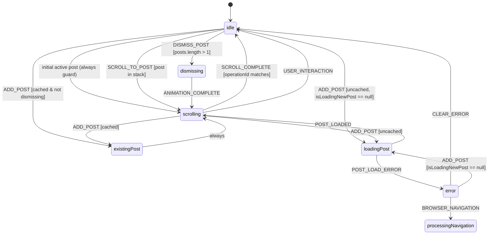
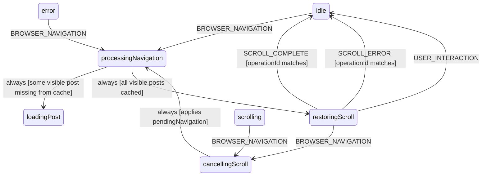
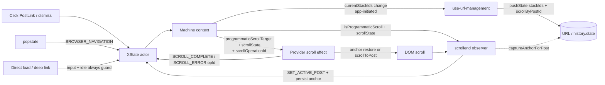
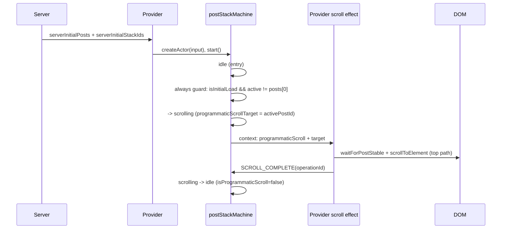
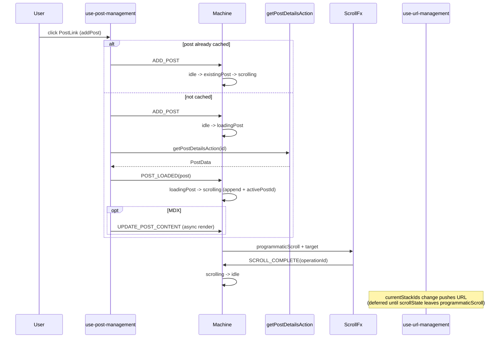
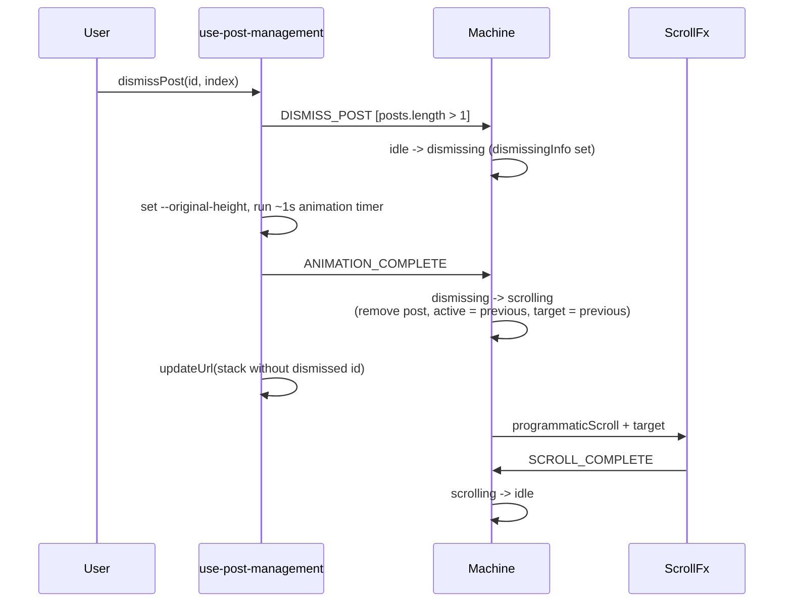
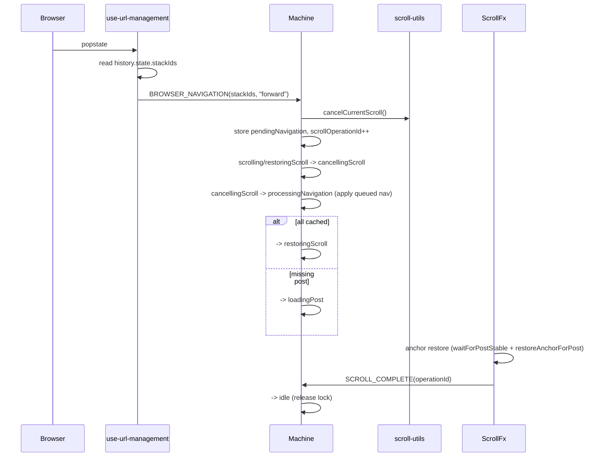
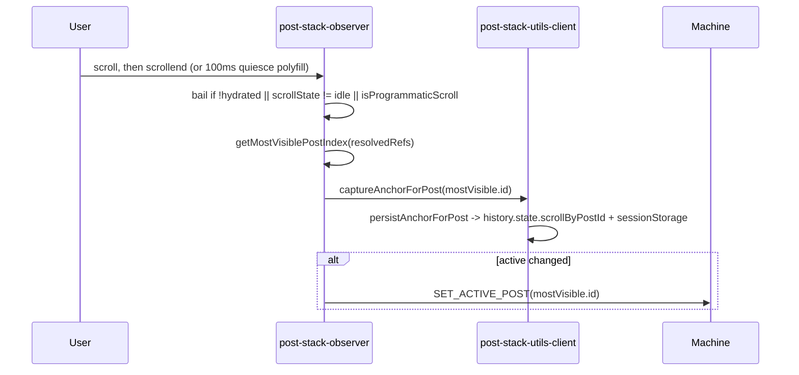

# Post Stack Statecharts

A live-code-grounded map of how the post-stack navigation system works: the XState
machine that owns transitions, the context fields that drive side effects, and the
browser / DOM / URL flows that live outside the machine.

**Source of truth:** `lib/post-stack-machine.ts`. Everything here is derived from that
machine and the hooks/components that send it events. This doc deliberately avoids line
numbers (they drift); search by symbol name. When the machine changes, update this doc —
see [Keeping diagrams grounded](#keeping-diagrams-grounded).

> Scope: this document explains **current** behavior. Suspected behavior gaps are
> isolated in [Follow-up candidates](#follow-up-candidates) and are not "how it should
> work" — they are flagged for a future bug-fix pass.

---

## 1. States at a glance

The machine has **nine** states. There are no `settled`, `settling`, or `settlingScroll`
states — older docs described those, but scroll completion is event-driven and lands
directly in `idle`. Home navigation is a full-page reload, not a machine state.

| State | Kind | Meaning | Observer / scroll lock |
|-------|------|---------|------------------------|
| `idle` | stable | Default resting state. The `scrollend` observer is live here. | unlocked |
| `loadingPost` | async wait | Fetching a not-yet-cached post (`getPostDetailsAction`). | — |
| `existingPost` | transient (`always`) | A clicked post is already in `posts`; set up its scroll. | locked |
| `scrolling` | event wait | Programmatic scroll animating to the target post. | locked |
| `dismissing` | event wait | TV-shutoff dismiss animation in progress (~1s timer in the hook). | — |
| `processingNavigation` | transient (`always`) | Browser-nav entry: decide load-vs-restore from cache. | — |
| `restoringScroll` | event wait | Restoring a post + reading anchor after browser nav. | locked |
| `cancellingScroll` | transient (`always`) | A browser nav arrived mid-scroll; apply the queued nav. | — |
| `error` | event wait | Post load failed. Recoverable via `CLEAR_ERROR`, `ADD_POST`, or `BROWSER_NAVIGATION`. | — |

"Transient (`always`)" states advance synchronously after their entry actions, so an
actor snapshot rarely catches the machine sitting in them.

---

## 2. Primary lifecycle



Home navigation has no machine state: `goHome()` performs a full-page reload
(`window.location.href = "/"`).

Notes:

- The `idle` **initial-active-post** `always` guard fires only on first load when
  `isInitialLoad` is true, there is an `activePostId`, the stack has more than one post,
  and the active post is not the first. It kicks off one scroll to the deep-linked post.
- `SET_ACTIVE_POST`, `UPDATE_POST_CONTENT`, and `ENABLE_OBSERVER` are
  **context-only** in `idle` (no state change) — see [Event inventory](#5-event-inventory).
- `scrolling` also accepts `ADD_POST` (the user can click a new `PostLink` mid-scroll)
  and `UPDATE_POST_CONTENT` / `SET_ACTIVE_POST` as context-only updates.

---

## 3. Browser back/forward navigation



- On `BROWSER_NAVIGATION` from `idle` **or `error`**, the shared `applyBrowserNavigation`
  action (plus `cancelActiveScroll`) calls `cancelCurrentScroll()` and rebuilds `posts`,
  `currentStackIds`, `visiblePostIds`, `activePostId`, and `programmaticScrollTarget` from
  `postCache` using the incoming `stackIds` (the last id becomes active), and clears
  `error`. The `stackIds` are order-preservingly de-duplicated so the stack-id arrays stay
  consistent with the post-id-deduped `posts`. `idle` and `error` share one definition so
  their semantics cannot drift — a failed load no longer strands back/forward navigation.
- If a browser nav arrives **during** an active programmatic scroll (`scrolling` or
  `restoringScroll`), the machine routes through `cancellingScroll`: it cancels the scroll,
  stores `pendingNavigation`, bumps `scrollOperationId` (so the dying scroll's late
  `SCROLL_COMPLETE` is ignored), then `cancellingScroll` `always`-transitions to
  `processingNavigation` after applying the queued navigation from `postCache`.

---

## 4. Side-effect bridge

The machine never touches the DOM, URL, or history directly. It mutates **context**, and
React effects/observers react to context changes.



Ownership by phase:

- **Direct load / deep link:** `history.state.stackIds` (or the parsed URL) seeds the
  actor input; the `idle` initial-active-post guard scrolls to the deep-linked post.
- **App-initiated navigation** (click / dismiss): machine context changes first; then
  `use-url-management` writes the URL via `pushState`. URL pushes are **deferred** while
  `scrollState === "programmaticScroll"` (held in `pendingStackIdsRef`) and flushed once
  the machine leaves programmatic scroll, so the browser never resets scroll mid-animation.
- **Browser navigation:** `history.state.stackIds` is canonical; the popstate handler
  hands it to the machine and the machine rebuilds posts from `postCache`.

### The programmatic-scroll executor

`post-stack-provider-xstate.tsx` runs an effect keyed on
`programmaticScrollTarget` + `scrollState`. When a target is set during
`programmaticScroll`, it defers one animation frame and then:

- **Anchor path** (scroll memory has an entry for the target): `waitForPostStable(...)`
  then `restoreAnchorForPost(...)` (instant jump to the saved heading + offset), then
  sends `SCROLL_COMPLETE`.
- **Top path** (no anchor): `scrollToPost(target, true)` smooth-scrolls to the top of the
  post; `use-scroll-management` sends `SCROLL_COMPLETE`. The provider also sends a
  follow-up `SCROLL_COMPLETE` (a no-op once the machine has already gone `idle`).
- On throw: sends `SCROLL_ERROR`.

All completion events carry the captured `operationId`; the machine's guard discards any
that don't match the current `scrollOperationId`.

---

## 5. Event inventory

Every event in the `PostStackEvent` union. "Dispatched by" lists where it is actually
sent today — some handled events are currently never dispatched (called out so diagrams
don't imply a flow that can't fire).

| Event | Payload | Role | Dispatched by |
|-------|---------|------|---------------|
| `ADD_POST` | `originalPostId` | Push/select a post (cached → `existingPost`, else `loadingPost`) | `use-post-management` (`addPost`) |
| `POST_LOADED` | `post`, `newPostId` | Async load resolved; append + scroll | `use-post-management` |
| `POST_LOAD_ERROR` | `error` | Async load failed → `error` | `use-post-management` |
| `DISMISS_POST` | `postId`, `index` | Begin dismiss animation → `dismissing` | `use-post-management` (`dismissPost`) |
| `ANIMATION_COMPLETE` | — | Dismiss animation done; remove post + scroll to previous | `use-post-management` (~1s timer) |
| `SCROLL_TO_POST` | `postId` | Programmatic scroll to an in-stack post | `use-scroll-management` |
| `SCROLL_COMPLETE` | `operationId?` | Scroll settled → `idle` (guarded by id) | provider scroll effect, `use-scroll-management` |
| `SCROLL_ERROR` | `error`, `operationId?` | Scroll failed → `idle` (only handled in `restoringScroll`) | provider scroll effect |
| `USER_INTERACTION` | — | User wheel/touch/key interrupted a programmatic scroll → `idle` | `use-user-scroll-interruption` |
| `SET_ACTIVE_POST` | `postId` | Context-only: update `activePostId` | `provider` (`setActivePost`), observer |
| `ENABLE_OBSERVER` | — | Context-only: release `isProgrammaticScroll` (idle but still locked) | `use-user-scroll-interruption` |
| `UPDATE_POST_CONTENT` | `postId`, `renderedContent`, `isContentReady?` | Context-only: swap in async-rendered MDX in `posts` + `postCache` | `use-post-management` (MDX serialize) |
| `BROWSER_NAVIGATION` | `stackIds` | Browser back/forward; rebuild (deduped) stack from cache; handled by `idle` and `error` | `use-url-management` (popstate) |
| `CLEAR_ERROR` | — | `error` → `idle` | **not dispatched** (recovery is via `ADD_POST` / `BROWSER_NAVIGATION`; retained for future error UI) |

---

## 6. Sequence flows

### 6.1 Direct load with a deep-linked active post



### 6.2 Clicking a `PostLink`



### 6.3 Dismissing a post



### 6.4 Browser back/forward during an active scroll



### 6.5 Observer scroll-memory capture



---

## 7. Race matrix

Only the guards needed to read the diagrams above.

| Mechanism | Where | What it prevents |
|-----------|-------|------------------|
| `isProgrammaticScroll` | machine context; read by `post-stack-observer` | Observer hijacking `activePostId` mid-programmatic-scroll. Released on `SCROLL_COMPLETE`/`USER_INTERACTION`/`ENABLE_OBSERVER`. |
| `scrollOperationId` | bumped on each scroll/cancel; carried in `SCROLL_COMPLETE`/`SCROLL_ERROR` | A stale (superseded) scroll's completion event flipping the machine to `idle`. |
| `pendingNavigation` + `cancellingScroll` | machine | Losing a browser nav that arrived while a scroll was being aborted. |
| `cancelCurrentScroll()` (AbortController) | `scroll-utils` | Two scroll animations running at once. |
| Deferred URL push (`pendingStackIdsRef`) | `use-url-management` | `pushState` during `programmaticScroll` resetting the browser's scroll position. |
| `isInternalUpdateRef` | `use-url-management` | The popstate handler re-firing on app-initiated URL writes. |
| `waitForPostStable` (Mutation + Resize observers, 2s cap) | `scroll-utils` | Reading `offsetTop` before a just-mounted post finished laying out. |
| `history.state.scrollByPostId` | `use-url-management` / `post-stack-utils-client` | Losing per-post reading position across back/forward; mirrored to `sessionStorage` for hard refreshes. |

---

## 8. Diagnostics

`globalThis.__postStackActor` is set while the provider is mounted
(`post-stack-provider-xstate.tsx`). In dev/test you can inspect state:

```js
const s = window.__postStackActor.getSnapshot();
s.value;                          // current state name, e.g. "idle" | "scrolling"
s.context.scrollState;            // "idle" | "programmaticScroll" | ...
s.context.isProgrammaticScroll;   // observer lock
s.context.scrollOperationId;      // current scroll generation
s.context.currentStackIds;        // visible stack
```

`tests/post-stack-scroll.spec.ts` uses exactly this to wait for a truly-idle machine
(`waitForMachineIdle`). This is a **dev/test diagnostic aid only** — `__postStackActor` and
its context shape are not a supported production API and may change; do not build product
features on it.

---

## Keeping diagrams grounded

This doc is hand-authored from `lib/post-stack-machine.ts`. It will rot if the machine
changes and this doc doesn't. Re-run these checks whenever you touch post-stack code:

### Validation checklist

1. **State names:** Do the nine states in §1 still match the `states:` keys in
   `lib/post-stack-machine.ts`? Are there still no `settled`/`settling`/`settlingScroll`?
2. **Event union:** Do the 16 events in §5 still match the `PostStackEvent` union? If an
   event was added/removed, update the inventory and any diagram that references it.
3. **Context invariants:** Do `isProgrammaticScroll`, `scrollOperationId`,
   `pendingNavigation`, and `programmaticScrollTarget` still exist in `PostStackContext`
   and still drive the §7 race matrix?
4. **Transition guards:** Do the `idle` initial-active-post `always` guard, the
   `processingNavigation` load-vs-restore split, and the `operationId` guards on
   `SCROLL_COMPLETE`/`SCROLL_ERROR` still match the diagrams?
5. **Dispatch reality:** Re-grep `actor.send({ type:` across hooks/components. If any
   event marked "not dispatched" in §5 gains a caller (or vice versa), update the table.

### When to update this doc

- Machine states, events, or context-invariant fields change.
- URL/history semantics change (e.g., `history.state` shape, deferred-push behavior).
- Scroll completion semantics change (operation-id guarding, the provider scroll effect).

### Optional follow-up tooling (not enabled)

- **XState Inspector / Stately:** useful for live transition tracing, but the actor's
  context carries rendered React content (`posts[].renderedContent`) that is large and
  non-serializable. Any inspector integration must be dev-only and sanitize/strip context
  before export. Deferred.
- **Generated diagrams from the machine AST:** consider only if these hand-maintained
  Mermaid diagrams start drifting often.

---

## Follow-up candidates

### Resolved

The following gaps surfaced during documentation have been fixed (see
`lib/post-stack-machine.test.ts` and the implementation in `lib/post-stack-machine.ts`):

- **Hard-coded popstate direction → removed.** The unused `direction` field was dropped from
  the `BROWSER_NAVIGATION` event, `pendingNavigation` context, and the popstate sender. The
  machine has no direction-dependent logic.
- **`GO_HOME` / `goingHome` → removed.** `goHome()` does a full `window.location.href = "/"`
  reload and never dispatched `GO_HOME`; the dead event and state were removed.
- **`URL_UPDATED` → removed.** It was never dispatched and was fully superseded by
  `BROWSER_NAVIGATION`.
- **Stale `SCROLL_SUCCESS` docblock reference → removed.** The docblock now names only
  `SCROLL_COMPLETE` / `SCROLL_ERROR`.
- **Duplicate-stack-id risk → fixed.** `currentStackIds` / `visiblePostIds` are now
  order-preservingly de-duplicated to match the post-id-deduped `posts`.
- **`error` stranded back/forward → fixed.** `error` now handles `BROWSER_NAVIGATION` via the
  same shared action as `idle`, so a failed load no longer swallows browser navigation.

`CLEAR_ERROR` is intentionally **retained** (not dispatched today) as the sanctioned
`error → idle` recovery transition for future error-recovery UI.

### Still open

- **User-interruption during `restoringScroll` skips operation-id check (no change).**
  `USER_INTERACTION` unconditionally returns to `idle` from both `scrolling` and
  `restoringScroll` with no `operationId` guard, unlike `SCROLL_COMPLETE`. This is **correct
  by design** — interruption is inherently "now" (the user physically scrolled), so releasing
  the lock unconditionally is right; adding a guard risks dropping a legitimate interrupt. No
  code change. Inspect: `lib/post-stack-machine.ts`, `hooks/use-user-scroll-interruption.ts`.
